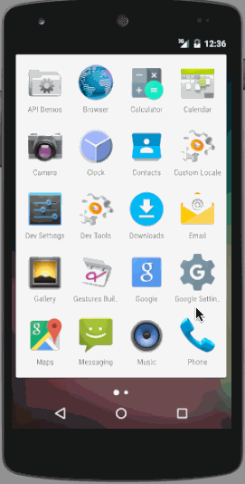

# Prework - ToDo

ToDo is a to-do list application for Android.

Submitted by: Peyt S. Dewar II

Time spent: 20 hours spent in total

Completed user stories:

 * [x] Required: Users can add and remove items from the to-do list
 * [x] Required: Users can click on a to-do item in the list in order to edit
 * [x] Required: To-do items are persistent and properly retrieved after every app restart
 * [x] Optional: To-do items can be created, read, updated, and deleted with SQL instead of text files
 * [x] Optional: To-do list is populated with a RecyclerView which implements a custom adapter
 * [x] Optional: Due dates are displayed in the RecyclerView and can be updated when editing the to-do item
 * [x] Optional: A DialogFragment instead of an Activity is used to add a new to-do item 

## Video Walkthrough 

GIF created with [LiceCap](http://www.cockos.com/licecap/).
## Notes

Spent some time connecting the SQL database to the RecyclerView and experimenting with different color palettes.

## License

    Copyright [2016] [Peyt S. Dewar II]

    Licensed under the Apache License, Version 2.0 (the "License");
    you may not use this file except in compliance with the License.
    You may obtain a copy of the License at

        http://www.apache.org/licenses/LICENSE-2.0

    Unless required by applicable law or agreed to in writing, software
    distributed under the License is distributed on an "AS IS" BASIS,
    WITHOUT WARRANTIES OR CONDITIONS OF ANY KIND, either express or implied.
    See the License for the specific language governing permissions and
    limitations under the License.
